# FINAL ENTITY-RELATIONSHIP DIAGRAM (ERD)

**Document:** `/docs/database/FINAL_ERD.md`  
**Repository:** `nguyendz2k4/WebCF` (`FE` Workspace)  
**Baseline Documents:**
- `/docs/database/DATABASE_SCHEMA.md`
- `/docs/database/FINAL_SCHEMA.md`

---

## 1. COMPREHENSIVE MERMAID ERD

```mermaid
erDiagram
    categories ||--o{ products : "classifies (composite FK on id, domain)"
    brands ||--o{ products : "manufactures/brands"
    products ||--|| equipment_specifications : "extends (1:1)"
    products ||--|| ingredient_specifications : "extends (1:1)"
    products ||--o{ product_media : "galleries (1:N)"
    products ||--o{ order_items : "referenced by (ON DELETE SET NULL)"
    users ||--o{ orders : "places (ON DELETE SET NULL)"
    orders ||--|{ order_items : "contains (1:N, ON DELETE CASCADE)"
    news_articles ||--|| news_article_content : "details (1:1)"

    categories {
        VARCHAR_50 id PK
        VARCHAR_100 name
        VARCHAR_100 slug UK
        VARCHAR_20 domain "equipment | ingredients"
        INTEGER sort_order
        BOOLEAN is_active
        TIMESTAMPTZ created_at
        TIMESTAMPTZ updated_at
    }

    brands {
        VARCHAR_50 id PK
        VARCHAR_100 name UK
        VARCHAR_100 slug UK
        VARCHAR_500 logo_url
        VARCHAR_50 origin_country
        BOOLEAN is_featured
        TIMESTAMPTZ created_at
        TIMESTAMPTZ updated_at
    }

    products {
        VARCHAR_50 id PK
        VARCHAR_150 slug UK
        VARCHAR_50 sku UK
        VARCHAR_255 name
        VARCHAR_20 domain
        VARCHAR_50 category_id FK
        VARCHAR_50 brand_id FK
        TEXT short_description
        BIGINT price "VND Integer"
        VARCHAR_20 price_type "fixed | from | contact"
        BOOLEAN is_in_stock "Sole Authoritative Availability"
        VARCHAR_255 lead_time_notice "Advisory logistics text"
        BOOLEAN is_featured
        VARCHAR_500 primary_image_url
        TIMESTAMPTZ created_at
        TIMESTAMPTZ updated_at
        TIMESTAMPTZ deleted_at "Soft Delete"
    }

    equipment_specifications {
        VARCHAR_50 product_id PK,FK
        INTEGER groups_count "1-4"
        VARCHAR_100 boiler_type
        VARCHAR_50 boiler_capacity
        VARCHAR_100 pump_type
        VARCHAR_50 power_wattage
        VARCHAR_20 voltage "220V | 380V | 220V/380V"
        VARCHAR_100 dimensions
        VARCHAR_50 weight
        VARCHAR_100 warranty_duration
        VARCHAR_100 daily_capacity
        JSONB suitable_for "Array of target segments"
    }

    ingredient_specifications {
        VARCHAR_50 product_id PK,FK
        VARCHAR_100 origin
        VARCHAR_100 sub_region
        VARCHAR_50 altitude
        VARCHAR_100 process_method
        VARCHAR_20 roast_profile "Light | Medium | Medium-Dark | Dark"
        DECIMAL cupping_score "80-100"
        JSONB flavor_notes "Array of sensory notes"
        VARCHAR_50 unit_size
        VARCHAR_50 case_size
        VARCHAR_50 shelf_life
    }

    product_media {
        INTEGER id PK
        VARCHAR_50 product_id FK
        VARCHAR_500 media_url
        INTEGER sort_order ">= 1 (Secondary gallery)"
        VARCHAR_255 alt_text
    }

    users {
        VARCHAR_50 id PK
        VARCHAR_150 name
        VARCHAR_255 email UK
        VARCHAR_30 phone
        VARCHAR_500 avatar
        VARCHAR_20 role "owner | barista | guest | admin"
        VARCHAR_150 shop_name
        TIMESTAMPTZ created_at
        TIMESTAMPTZ updated_at
        TIMESTAMPTZ deleted_at
    }

    orders {
        VARCHAR_50 id PK
        VARCHAR_30 order_code UK "e.g. AURA719245"
        VARCHAR_50 user_id FK "Nullable"
        BIGINT total_amount "Authoritative snapshot"
        VARCHAR_20 payment_method "cod | vietqr"
        VARCHAR_30 payment_status "pending_verification | confirmed | rejected"
        VARCHAR_30 order_status "received | processing | dispatched | completed | cancelled"
        VARCHAR_150 shipping_recipient_name
        VARCHAR_30 shipping_phone
        VARCHAR_255 shipping_email
        VARCHAR_255 shipping_address_line
        VARCHAR_100 shipping_province
        VARCHAR_100 shipping_district
        TEXT shipping_note
        TIMESTAMPTZ created_at "Immutable"
        TIMESTAMPTZ updated_at
    }

    order_items {
        VARCHAR_50 id PK
        VARCHAR_50 order_id FK
        VARCHAR_50 product_id FK "Nullable (ON DELETE SET NULL)"
        VARCHAR_255 snapshotted_title
        VARCHAR_50 snapshotted_sku
        BIGINT snapshotted_unit_price
        INTEGER quantity
        VARCHAR_255 snapshotted_specs
        BIGINT line_total "unit_price * quantity"
    }

    news_articles {
        VARCHAR_50 id PK
        VARCHAR_150 slug UK
        VARCHAR_255 title
        TEXT excerpt
        VARCHAR_50 category "new-products | market-trends | barista-tech"
        VARCHAR_50 published_at
        VARCHAR_500 cover_image_url
        BOOLEAN featured
        VARCHAR_100 author_name "Embedded VO"
        VARCHAR_150 author_role "Embedded VO"
        VARCHAR_500 author_avatar_url "Embedded VO"
        JSONB tags "Native Array / JSON"
        TIMESTAMPTZ created_at
        TIMESTAMPTZ updated_at
        TIMESTAMPTZ deleted_at
    }

    news_article_content {
        VARCHAR_50 article_id PK,FK
        TEXT lead_paragraph
        JSONB structured_sections "Headings, bodies, quotes, images"
    }

    contact_inquiries {
        VARCHAR_50 id PK
        VARCHAR_30 inquiry_type "general | consultation | quote"
        VARCHAR_150 sender_name
        VARCHAR_30 phone
        VARCHAR_255 email
        VARCHAR_150 company_name
        VARCHAR_100 budget_range
        TEXT message
        VARCHAR_20 status "new | contacted | converted | archived"
        TIMESTAMPTZ created_at
    }
```



---

## 2. ASCII STRUCTURAL TOPOLOGY

```
[categories] (1) ──── (N) [products] (1) ──── (1) [equipment_specifications]
  │ (id, domain)           │ (category_id, domain)
  │                        │
  │                        ├── (1) ──── (1) [ingredient_specifications]
  │                        │
[brands] (1) ──────────────┼── (1) ──── (N) [product_media]
                           │
                           └── (0..1) ── (N) [order_items] (N) ──── (1) [orders]
                                                                          │
                                                                 (0..1) ──┘
                                                             [users]
                                                             (No Address Columns)

[news_articles] (1) ──── (1) [news_article_content]
  │ (Embedded author & tags)

[contact_inquiries] (Standalone CRM Root)
```

---

## 3. CARDINALITY & CASCADE RULES MATRIX

| Parent Table | Child Table | Cardinality | Foreign Key Column | On Delete Action | On Update Action |
|---|---|---|---|---|---|
| `categories` | `products` | 1:N | `(category_id, domain)` | `RESTRICT` | `CASCADE` |
| `brands` | `products` | 1:N | `brand_id` | `RESTRICT` | `CASCADE` |
| `products` | `equipment_specifications` | 1:1 | `product_id` | `CASCADE` | `CASCADE` |
| `products` | `ingredient_specifications`| 1:1 | `product_id` | `CASCADE` | `CASCADE` |
| `products` | `product_media` | 1:N | `product_id` | `CASCADE` | `CASCADE` |
| `products` | `order_items` | 0..1:N | `product_id` | `SET NULL` | `CASCADE` |
| `users` | `orders` | 0..1:N | `user_id` | `SET NULL` | `CASCADE` |
| `orders` | `order_items` | 1:N | `order_id` | `CASCADE` | `CASCADE` |
| `news_articles` | `news_article_content` | 1:1 | `article_id` | `CASCADE` | `CASCADE` |
